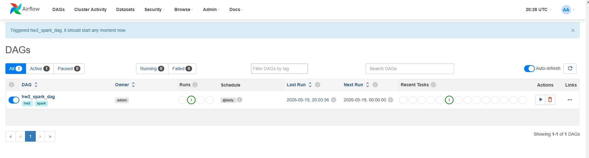
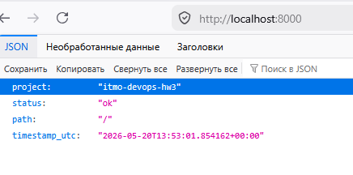

# HW2 Airflow + Spark





## Логика DAG

`hw2_spark_dag` состоит из трех шагов:

1. `start` — стартовая заглушка.
2. `run_spark_job` — запуск spark-job через `SparkSubmitOperator`.
3. `finish` — финальная заглушка.

Spark job:
- генерирует тестовый набор данных;
- считает агрегаты по категориям (`count`, `avg`, `min`, `max`);
- сохраняет JSON-отчет в `reports/hw2_spark_report_<date>.json`.

## Как запустить

```powershell
# в корне проекта, где лежит docker-compose.yml
cd <path_to_project>
docker compose up -d --build
```

Airflow UI: `http://localhost:8080` (admin/admin)
Spark master UI: `http://localhost:4040`

## Подключение Spark в Airflow

В Airflow нужно создать Connection:

- Conn Id: `spark_local`
- Conn Type: `Spark`
- Host: `spark-master`
- Port: `7077`

После этого можно запускать DAG `hw2_spark_dag`.
