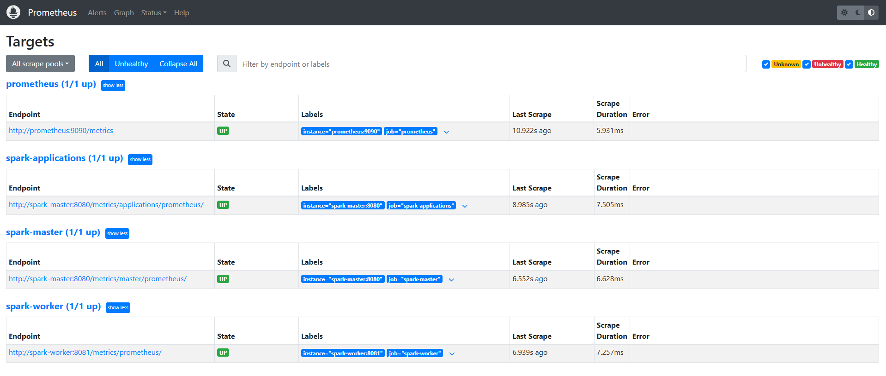
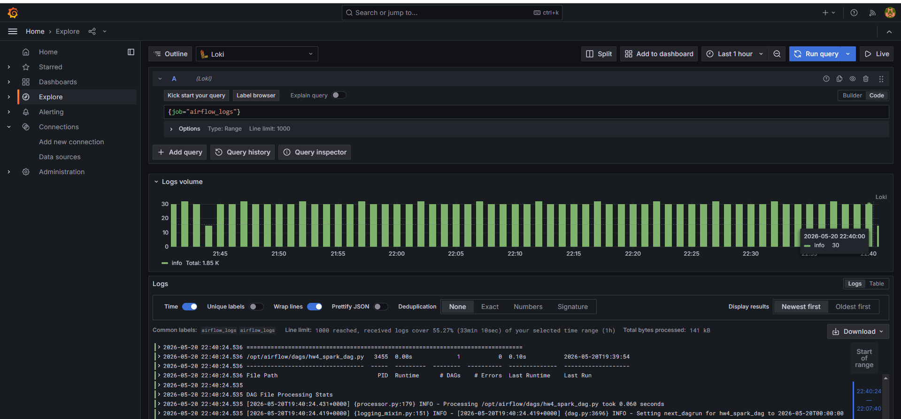

# HW4 Airflow + Spark Observability





## Что реализовано

- Поднят стек мониторинга: Loki + Alloy + Prometheus + Grafana.
- Логи Airflow вынесены во внешний volume `./logs`.
- Логи Spark вынесены во внешний volume `./spark-logs`.
- Добавлен сбор логов через Alloy с отправкой в Loki.
- Добавлен сбор Spark-метрик через Prometheus (`spark-master`, `spark-worker`).
- Добавлен Grafana dashboard `HW4 Spark Observability` c 2 панелями.
- Сохранен DAG со Spark job для генерации событий и логов: `hw4_spark_dag`.

## Как запустить

```powershell
cd <path_to_hw4>
copy .env.example .env
docker compose up -d --build
```

UI:

- Airflow: `http://localhost:8080` (admin/admin)
- Spark master: `http://localhost:4040`
- Prometheus: `http://localhost:9090`
- Grafana: `http://localhost:3000` (admin/admin)

## Airflow Connection

Создай Connection `spark_local`:

- Conn Id: `spark_local`
- Conn Type: `Spark`
- Host: `spark-master`
- Port: `7077`
